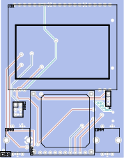
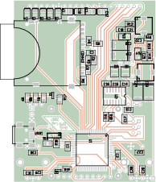
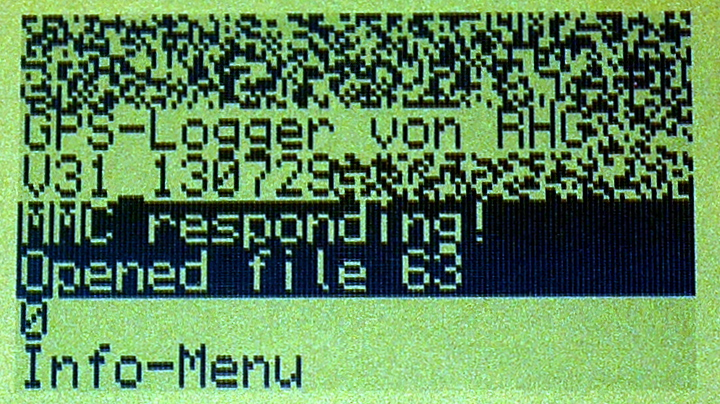

# GPS-logger

    

GPS-logger project (based on university course: "EDA, PCB and AVR-Microcontroller")

## Structure

- `PCB/`   schematics of the electronic circuits (`*.sch`) as well as the PCB layouts (`*.pcb`)
  - `PCB/gschem-sym/`   symbols for gschem (referenced from PCB/gafrc)
  - `PCB/pcb-elements/`   custum footprints for non-standard devices used in the layouts (get included in `*.pcb`)
- `code/`   c-files for the firmware
  - `code/unused/`   unused files from ATMega-DOS (from Holger Klabunde)

Software from the [gEDA project](http://www.geda-project.org/) was used to create the PCB:
- [gschem](http://wiki.geda-project.org/geda:gaf) for the schematics (`*.sch`)
- [PCB](http://pcb.geda-project.org/) for the layouts  (`*.pcb`)

## Images

fotos:

  

schematics (also as [PDF](IMGs/schematics.pdf)):

pcb layout ([SVGs](IMGs/)):

 

screen shots of the 7 display-modes (satelite view and satelite list):

 
